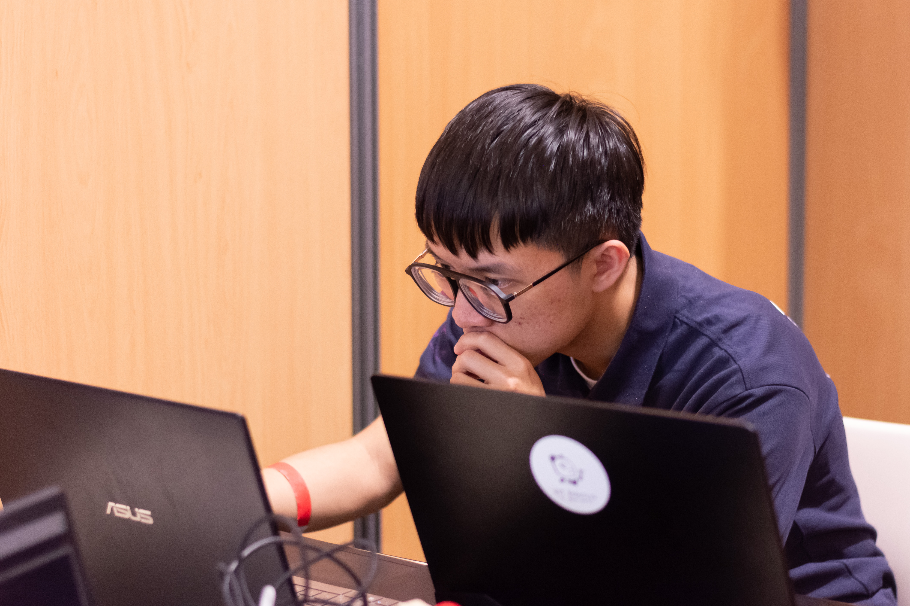

# About

I am **Yu-Chung Chen**, a graduate student at the Graduate Institute of Networking and Multimedia, National Taiwan University. My research and engineering interests center on **robotics**, **reinforcement learning**, and **embodied AI**—from training agents in simulation and bridging the Sim2Real gap to building robust navigation and control systems for mobile and legged robots.

I hold a B.S. from the Interdisciplinary Program of Electrical Engineering and Computer Science at National Tsing Hua University. I have interned at **Inventec Corporation** (AI Center) and contributed to **DIT Robotics** as a team member, and I have received awards at the AMD Pervasive AI Developer Contest, Eurobot International, and NCHC Open Hackathon.

