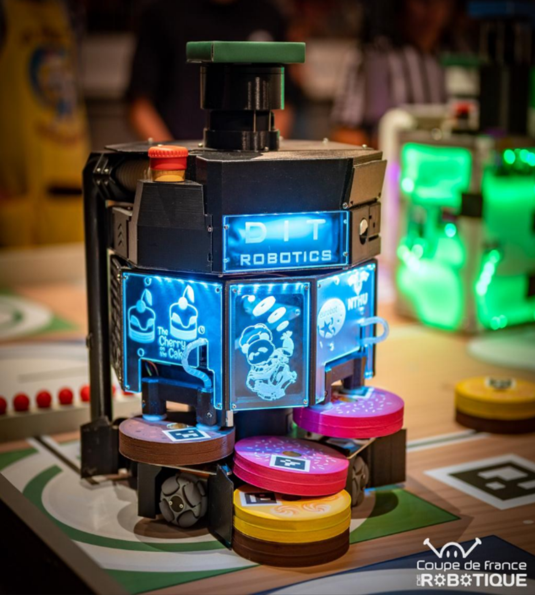

# Awards & Achievements

### [AMD Pervasive AI Developer Contest](https://www.hackster.io/contests/amd2023#category-1091)
*San Francisco, USA · [Github](https://github.com/YuZhong-Chen/LLM-Navigation)*

**Third Prize** · Oct 2024

- Built a powerful navigator by combining the hierarchical structure of **3D Scene Graphs** with the reasoning capabilities of **Large Language Models**, enabling efficient object navigation.

---

### [Eurobot International Students Robotic Contest](https://www.eurobot.org/eurobot-contest/eurobot-2023/)
*Nantes, France*

{ width="400" }

**Fifth Prize, Innovation Prize** · May 2023

- Developed the navigation system using the **ROS1 navigation stack**, with the goal of reaching the destination via the shortest path while avoiding other robots.
- Designed an additional mechanism to **predict motion trajectories** of other robots and initiate preemptive responses, improving dynamic obstacle avoidance and efficiency.

---

### NCHC Open Hackathon  
*Hsinchu, Taiwan*

**Achieved 11× speedup** · Dec 2024

- Used **NVIDIA Nsight Systems** to analyze program bottlenecks and accelerate the pipeline through parallelization.
- Utilized **TensorRT** and **CuPy** to speed up model inference.

---

### TEL Robot Competition  
*Kaohsiung, Taiwan*

{ width="400" }

**Advanced to the finals** · Dec 2022

- Served as **team leader**, overseeing development and coordinating tasks.
- Developed controllers for robotic arms and assisted in developing navigation and localization systems.
