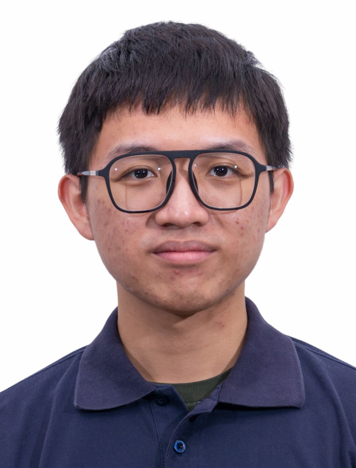

  

# Yu-Chung Chen

**Graduate student in Networking & Multimedia** · National Taiwan University · Taipei, Taiwan
{: .hero-tagline }

I am an M.S. student at the Graduate Institute of Networking and Multimedia, National Taiwan University, with a background in Electrical Engineering and Computer Science from National Tsing Hua University. My work focuses on robotics, reinforcement learning, and embodied AI.

- **Email:** [yuzhong1214@gmail.com](mailto:yuzhong1214@gmail.com)
- **GitHub:** [YuZhong-Chen](https://github.com/YuZhong-Chen)

---

## Focus Areas

- **Robotics & navigation**
- **Reinforcement learning**
- **Systems & optimization**
